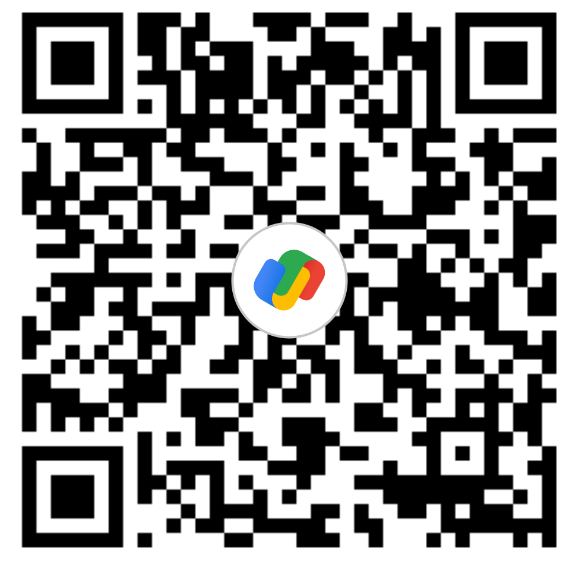

# ZMR Music 🎵

A premium, high-performance YouTube Music client built with Flutter. ZMR focuses on a sleek, gesture-driven experience with high-fidelity audio and robust background playback.


## ✨ Features

- **Dynamic Home Feed**: Modernized discovery with category-based filtering chips and structured sections like "Quick Picks".
- **Advanced Playback**: Integrated controls for Crossfade, Gapless playback, and Volume Normalization.
- **Background Playback**: Full support for lock-screen controls and persistent audio sessions.
- **Interactive UI Elements**: Glassmorphic "Update Banner" push notifications and responsive, skeleton-loading interfaces.
- **Onboarding & Help**: Automatic interactive video tutorials for new users learning app gestures.
- **Analytics & Push**: Full Firebase Cloud Messaging (FCM) and Analytics integration for real-time updates and crash reporting.

## 🚀 Getting Started

### Prerequisites
- Flutter SDK (Latest Stable)
- Android Studio / Xcode
- A YouTube Music account

### Setup
1. Clone the repository.
2. Run `flutter pub get`.
3. Follow the **Cookie Onboarding** guide within the app to connect your account.
4. Launch the app: `flutter run`.

## 🛠️ Technology Stack

- **Framework**: Flutter
- **State Management**: Riverpod
- **Audio Engine**: `just_audio` & `audio_service`
- **Backend Infrastructure**: Cloudflare Workers
- **Database (Auth)**: Supabase

ZMR is designed with privacy in mind. Your YouTube cookies are stored **locally** in your device's secure cache and are never uploaded to any external database.

For more information, please read our legal agreements:
- [Privacy Policy](PRIVACY_POLICY.md)
- [Terms of Service](TERMS_OF_SERVICE.md)

---


## 📄 License

This project is licensed under the MIT License - see below for details:

```
MIT License

Copyright (c) 2026 ZMR Team

Permission is hereby granted, free of charge, to any person obtaining a copy
of this software and associated documentation files (the "Software"), to deal
in the Software without restriction, including without limitation the rights
to use, copy, modify, merge, publish, distribute, sublicense, and/or sell
copies of the Software, and to permit persons to whom the Software is
furnished to do so, subject to the following conditions:

The above copyright notice and this permission notice shall be included in all
copies or substantial portions of the Software.

THE SOFTWARE IS PROVIDED "AS IS", WITHOUT WARRANTY OF ANY KIND, EXPRESS OR
IMPLIED, INCLUDING BUT NOT LIMITED TO THE WARRANTIES OF MERCHANTABILITY,
FITNESS FOR A PARTICULAR PURPOSE AND NONINFRINGEMENT. IN NO EVENT SHALL THE
AUTHORS OR COPYRIGHT HOLDERS BE LIABLE FOR ANY CLAIM, DAMAGES OR OTHER
LIABILITY, WHETHER IN AN ACTION OF CONTRACT, TORT OR OTHERWISE, ARISING FROM,
OUT OF OR IN CONNECTION WITH THE SOFTWARE OR THE USE OR OTHER DEALINGS IN THE
SOFTWARE.
```

---

## 💖 Support the Developer

If you love ZMR and want to support its development, consider making a donation! 

**UPI ID**: `adilrahman3063-1@okicici`



---

Built with ❤️ by the ZMR Team.
